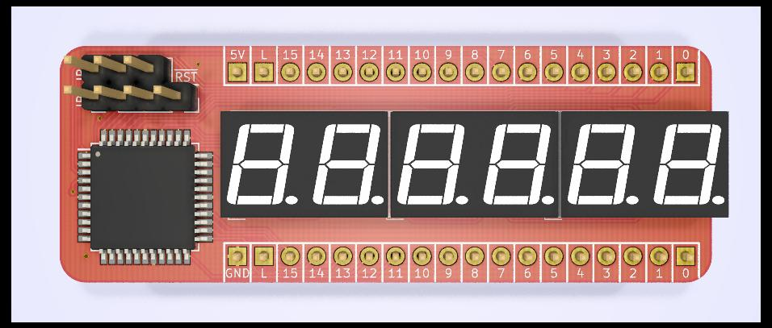
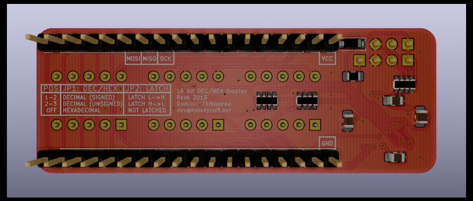
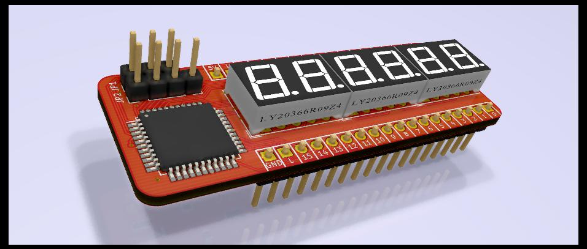

# Six-digit seven-segment indicator for 16 bit values
Rev A August 2019

- ATmega8535 microcontroller running at 8MHz (internal clock)
- 3x2 digit 7-segment display
- Configurable modes via jumpers:
  - Decimal / HEX mode
    - Signed Decimal (-32768-32767)
    - Unsigned Decimal (0-65535)
    - Hexadecimal (0-FFFF)
  - Latch mode
    - Latch value on L->H transition
    - Latch value on H->L transition
    - Unlatched (live display)

Images
============
|Front                                                 | Back                                              |
|------------------------------------------------------|---------------------------------------------------|
|||

### Schematics (pdf)
- [Complete schematics](./img/schema.pdf)

### PCB Images (svg)
- [Top](./img/pcb-front.svg)
- [Bottom](./img/pcb-back.svg)
